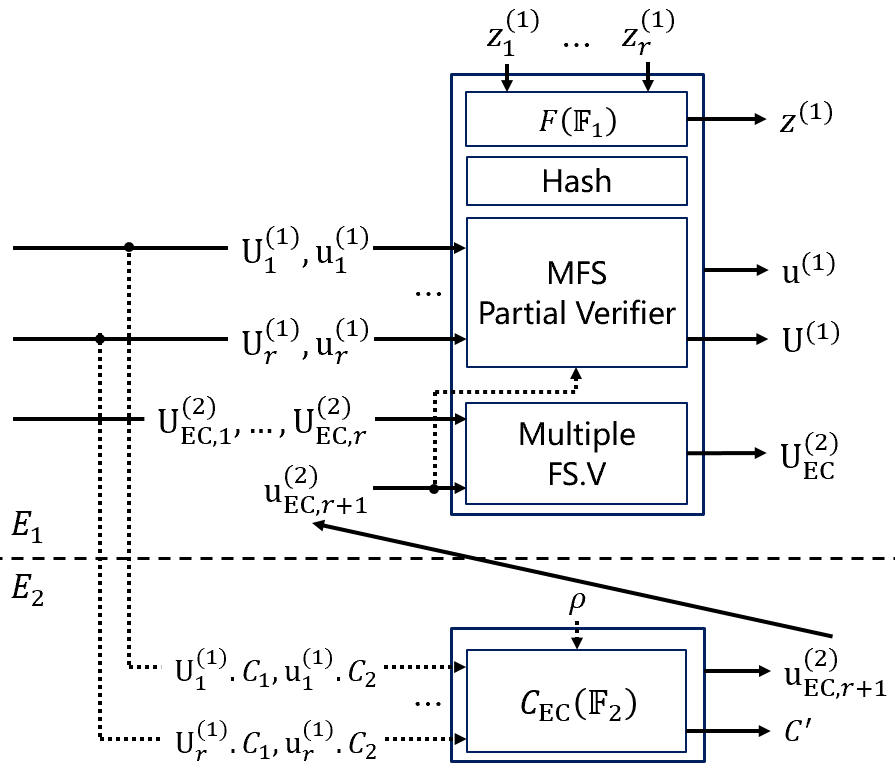

# Proof-Carrying Data from Multi-folding Schemes

This repository provides an implementation of a [proof-carrying data (PCD) scheme](https://people.eecs.berkeley.edu/~alexch/docs/CT10.pdf) from [multi-folding schemes](https://eprint.iacr.org/2023/573.pdf).

PCD is a powerful cryptographic primitive that enables mutually distrustful parties to perform distributed computations defined on directed acyclic graphs, while every intermediate state of the computation can be verified efficiently. A multi-folding scheme is defined with respect to a pair of relations $(\mathcal{R}_1,\mathcal{R}_2)$. It is an interactive protocol between a prover and a verifier in which the prover and the verifier reduce the task of checking multiple instances in $\mathcal{R}_1$ with structure $\mathsf{s}_1$ and an instance in $\mathcal{R}_2$ with structure $\mathsf{s}_2$ into the task of checking a single instance in $\mathcal{R}_1$ with structure $\mathsf{s}_1$, as long as $(\mathsf{s}_1,\mathsf{s}_2)$ satisfy a pre-defined predicate (e.g., that the two structures are equal). The multi-folding scheme is one of the most advanced techniques to construct efficient PCD schemes.

## Explanations

For efficiency, our implementation adapts [CycleFold](https://eprint.iacr.org/2023/1192.pdf), a conceptually simple approach to instantiate folding-scheme-based recursive arguments over a cycle of elliptic curves, into the PCD scenario. The following figure depicts an overview of our approach. In addition, we implement a SNARK, based on [Spartan](https://eprint.iacr.org/2019/550.pdf) and [SuperSpartan](https://eprint.iacr.org/2023/552.pdf), to compress PCD proofs.

  

## Tests

Run tests using  `cargo test --release`.

## References

The following paper provides theoretical details of this implementation and associated schemes.  
[Proof-Carrying Data from Multi-folding Schemes](https://eprint.iacr.org/2023/1282.pdf)  
Zibo Zhou, Zongyang Zhang, Zhiyu Zhang, and Jin Dong  
IACR ePrint 2023/1282

Our implementation is inspired by and adapted from the [Nova repository](https://github.com/microsoft/Nova) and the [multifolding-poc repository](https://github.com/privacy-scaling-explorations/multifolding-poc).
